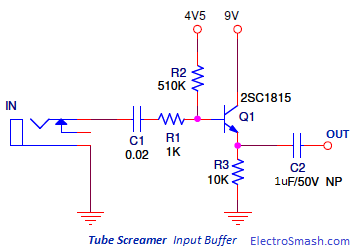

+++
title = "TCP local bypass"
date = 2026-07-28
description = "Bypassing the Linux TCP stack for local connections with a Rust kernel module: shared ring buffers, socket wait queues and some ftrace hooks."
+++

While running some local TCP services that were bandwidth bound, I started
wondering if there was a way to squeeze some extra Gbps out of my box.
TCP and the `socket()` API are great: they provide an abstraction for a reliable
stream of bytes that works both with 2 local endpoints on the same host as well
as with 2 endpoints talking to each other through multiple hops over undersea
cables. But that abstraction has some costs that for local connections perhaps
can be avoided.

So what options do we have to save on those costs?

Shared memory is a good first stop: no network stack overhead and potentially
the lowest possible latency if you synchronize your processes over a spinlock
(otherwise eventfd or similar will work great as well).
For fun I quickly ~vib~-_sketched_ an implementation for a [SHM RPC
lib](https://github.com/jibi/shm-rpc-rs). But it didn't take me too long to
discard that option: I wanted something transparent, that keeps using the
familiar `socket` API and addressing format, and that doesn't require me to
patch and recompile my services.

`LD_PRELOAD` could be another option: we hook into `socket()` / `bind()` /
`connect()` / `accept()` / `read()` / `write()` / `recv()` / `send()` / `poll()`
/ `epoll()` / `select()` / `close()` (did I forget something? probably) and
transparently pipe the TCP payload data into the SHM implementation. But
unfortunately this doesn't fly for static binaries, and requires passing the
`LD_PRELOAD` env variable and the `.so` object around, as well as granting
access to the shared memory region. A bit easier for non containerized
workloads, more work for containers. Anyway, discarded for the same reason as
before: needs to be transparent, should not require me to mess too much with my
services, and ideally the kernel should keep handling as much as possible of the
connection lifecycle. Only the data transfer part should be bypassed.

The next option to consider would then be kernel bypass, and as I have played
already in the past with different technologies in this space I knew in advance
this could help me deliver some extra Gbps. But since here I'm only interested
in _local_ connections, it seems like I don't even need to push my data down to
the NIC? Maybe there's something simpler we can do here?

## Rough idea

Let's start from a very hand-wavy kind of idea: let's move in kernel space, take
`tcp_sendmsg()` and "pipe" it, whatever that means in practice, straight into
`tcp_recvmsg()`.

(Why not hook higher up in the call stack? `sys_{sendto,recvfrom}()`,
`sock_{send,recv}()` and `inet_{send,recv}msg()` are mostly thin
wrappers/dispatchers, so hooking `tcp_{send,recv}msg()` lets us ignore for free
all the non TCP traffic).

What comes into one side comes out straight onto the other end. No network stack
overhead, no TCP/IP headers, no SKBs, nothing: just the TCP payload copied from
the sender to the receiver. And since in a previous post we learnt [how to write
Rust LKM modules](https://jibi.io/blog/xdp-rust-lkm/), we'll resume from there,
and reuse all the stuff we already know.

But first, what's really all this overhead about? We can once again turn to
ftrace to get a sense of what's going on by using `trace-cmd` to set up tracing
and collect the events.

Here's what happens when you send one byte from a `nc` client to a `nc` server
running on the same box (note that this is just the data transmission part, the
connection is already established). We'll start from `tcp_sendmsg()` and go
through the entire network stack calltrace:

{{ scroll_code(path="content/blog/tcp-local-bypass/tcp_sendmsg") }}

To my surprise, a single `tcp_sendmsg()` call on loopback captures the entire
roundtrip. Here's a non exhaustive summary to get a rough idea of what's going
on:

1. Socket lock acquired: `lock_sock_nested()` at the top of `tcp_sendmsg()`. The
   sender holds this lock for the entire duration of the roundtrip.

2. Send data: `tcp_sendmsg_locked()` calculates MSS (`tcp_send_mss()`),
   allocates the SKB (`tcp_stream_alloc_skb()`), attaches the skb to the socket
(`tcp_skb_entail()`), refills the page fragment (`sk_page_frag_refill()`) then
calls `tcp_push()` -> `tcp_write_xmit()` -> `__tcp_transmit_skb()` which builds
the TCP/IP header and calls `ip_queue_xmit()` which figures out the packet is
local and calls `ip_local_out()`. The packet then traverses netfilter
(`nf_hook_slow()`) twice (once at `OUTPUT`, once at `POSTROUTING`): conntrack
(`nf_conntrack_in()`, `nf_conntrack_tcp_packet()`) updates the connection state,
and nftables (`nft_do_chain()`) evaluates the ruleset. The packet then reaches
`ip_finish_output()` -> `ip_finish_output2()` -> `dev_hard_start_xmit()` ->
`loopback_xmit()`, which frees the write-side skb (`tcp_wfree()`) and enqueues
the packet to the RX backlog via `__netif_rx()` -> `enqueue_to_backlog()`.

3. Receive data: `__local_bh_enable_ip()` after `loopback_xmit()` triggers
   softirq processing inline. `net_rx_action()` -> `process_backlog()` ->
`ip_rcv()` -> netfilter again (`PREROUTING`, `INPUT`: conntrack, nftables
ruleset evaluation) -> `tcp_v4_rcv()` -> `tcp_rcv_established()`, which inside
processes the ACK fields (`tcp_ack()`), queues the payload into the receive
buffer (`tcp_data_queue()`), then `tcp_data_ready()` -> `sock_def_readable()` ->
`__wake_up_sync_key()` -> `pollwake()` -> `try_to_wake_up()` wakes the receiver
task via `ttwu_queue_wakelist()`.

4. Send ACK: still in the same softirq, `__tcp_ack_snd_check()` ->
   `tcp_send_ack()` -> `__tcp_send_ack.part.0()` allocates a new SKB and calls
`__tcp_transmit_skb()` again. The ACK traverses the full IP/netfilter stack a
second time, hits `loopback_xmit()` again, and is enqueued to the RX backlog via
`__netif_rx()`. A nested softirq picks it up: `tcp_v4_rcv()` ->
`tcp_add_backlog()`.

5. Socket lock released: `release_sock()` at the bottom of `tcp_sendmsg()`.
   `__release_sock()` drains the backlog: `tcp_v4_do_rcv()` ->
`tcp_rcv_established()` -> `tcp_ack()` processes the ACK, updating RTT
(`tcp_ack_update_rtt()`), congestion window, pacing rate, and freeing the
original SKB. Only now does the sender learn the data was received.

That's quite a lot of stuff going on for sending one byte. And the 2 peers are
running on the host namespace. Surely for real workloads with lots of traffic
GSO and GRO will help with batching some of these operations, but you get an
idea of the amount of logic that is needed to move bytes locally if you use TCP.

I won't include the calltrace for the 2-peers-on-2-containers case, but you
would get roughly twice the depth of the host namespace case, as you cross the 2
containers' network stacks plus the host network for L2/L3 routing.

Let's then measure some numbers with plain `iperf -s` and `iperf -c <ip> -n 100G` on my
laptop first to get a sense of the baseline numbers.

Client and server on the host namespace:

```
[nix-shell:~]$ iperf -s
[..]
[ ID] Interval           Transfer     Bitrate
[  5]   0.00-29.00  sec   200 GBytes  59.2 Gbits/sec                  receiver
```

So `60Gbits/s` is our number to beat, and I genuinely have no idea how much we
can save (if anything).

Client and server on different containers/network namespaces:

```
[ ID] Interval           Transfer     Bitrate
[  5]   0.00-19.07  sec   100 GBytes  45.0 Gbits/sec                  receiver
```

This instead shows that inter-container costs us ~25% of the original bandwidth.

## Let's improve our dev environment

As calling random and unexported kernel functions with random args and
forgetting to acquire/release random locks or refcounts might panic your kernel
and corrupt the fs, let's do responsible development and set up a VM.

I won't admit it took me a handful of panics to overcome my laziness and set up
a VM. Which tbf is a shame.

If I'd followed my trusted playbook, I would have had to download a Debian ISO,
create a new libvirt instance with `virt-manager` (click click), manually
install the system (click click again, my bad I never really looked into
cloud-init images), `apt install` some dev packages, `ssh-copy-id` to set up SSH
keys, create a snapshot just in case, and only then I would have been ready to
test things (so laziness was kind of justified).

But now on NixOS all I need to do is add to my `flake.nix` a new `nixosSystem`
instance under `nixosConfigurations.vm`, and in a minute or so I have a bootable
qcow2 image already configured with a serial console (in case our module breaks
the network), with the packages I need (mostly iperf), with my `/nix` store
already mounted (this means I can build the module on my host and it's instantly
available in the VM), and with my SSH keys already in `authorized_keys`. Quite
handy.

So, let's do that and add a minimal VM config:

```
      nixosConfigurations.vm = nixpkgs.lib.nixosSystem {
        inherit system;

        modules = [
          nix-dev-vm-ssh.nixosModules.default
          {
            boot = {
              loader.grub.device = "nodev";
              kernelPackages = pkgs.linuxPackages_latest;
            };

            networking = {
              hostName = "tcp-local-bypass-vm";
              useDHCP = true;
            };

            environment.systemPackages = with pkgs; [ iperf3 ];

            users.users.root.password = "root";

            fileSystems."/" = {
              device = "/dev/disk/by-label/nixos";
              fsType = "ext4";
            };

            virtualisation.vmVariant.virtualisation = {
              cores = 2;
              memorySize = 1024;
              graphics = false;
            };

            system.stateVersion = "26.05";
          }
        ];
      };
```

and an app to start it with `nix run .#vm`:

```
      apps.${system} = {
        vm = {
          type = "app";
          meta.description = "Boot the test VM";

          program = pkgs.lib.getExe (
            let
              vm = nixosVmConfig.system.build.vm;
              hostname = nixosVmConfig.networking.hostName;
            in
            nix-dev-vm-ssh.lib.mkVmExe {
              inherit pkgs nixosVmConfig;

              text = ''
                exec ${vm}/bin/run-${hostname}-vm "$@"
              '';
            }
          );
        };
```

here `nixosVmConfig` is just a let binding for
`self.nixosConfigurations.vm.config` while that
[`nix-dev-vm-ssh`](https://github.com/jibi/nix-dev-vm-ssh) is just a small flake
to generate ephemeral keys and configure SSH access to the VM. You can surely
point the flake to your own SSH key, but I wanted something that doesn't require
me to hardcode the path of an existing key (i.e. you can `git clone && nix run`
it and it just works) and doesn't need `--impure` to run.

Anyway, a minute or so and our VM is ready:

```
➜  tcp-local-bypass git:(master) nix run .#vm
[..]

<<< Welcome to NixOS 26.11.20260726.624af66 (x86_64) - ttyS0 >>>

Run 'nixos-help' for the NixOS manual.

tcp-local-bypass-vm login: root
Password:

[root@tcp-local-bypass-vm:~]# uname -a
Linux tcp-local-bypass-vm 7.1.5 #1-NixOS SMP PREEMPT_DYNAMIC Fri Jul 24 14:21:27 UTC 2026 x86_64 GNU/Linux
```

## Testing the waters

Let's start with something simple to test the basics: let's hook into
`tcp_sendmsg()` and if the connection is local skip the network stack and push the
data directly into the receiving socket (no idea yet what that means in practice
but bear with me).

We'll need some ftrace help also here but there's a twist: we'll need to
_selectively_ redirect the execution to our hook, only if the socket is local.
Which means inside the ftrace callback, whose signature looks something like:

```
unsafe extern "C" fn cb(ip: c_ulong,
                        parent_ip: c_ulong, op:
                        *mut ftrace_ops,
                        fregs: *mut ftrace_regs)
```

we need to access the `tcp_sendmsg()` args, specifically the `struct sock_common`,
to determine if it's local or not.

Let's start by defining a macro to extract the args from the registers into
their actual type (this is of course x86_64 specific, but for a POC it will be fine):

```
macro_rules! ftrace_args {
    ($fregs:expr, $($name:ident : $ty:ty),+ $(,)?) => {
        ftrace_args!(@step $fregs, [di si dx cx r8 r9], $($name: $ty),+)
    };

    (@step $fregs:expr, [$reg:ident $($_rest:ident)*], $name:ident : $ty:ty) => {
        let $name: $ty = unsafe {
            let __regs = &(*($fregs as *const __arch_ftrace_regs)).regs;
            __regs.$reg as usize as $ty
        };
    };

    (@step $fregs:expr, [$reg:ident $($rest:ident)*],
           $name:ident : $ty:ty, $($rn:ident : $rt:ty),+) => {
        ftrace_args!(@step $fregs, [$reg], $name: $ty);
        ftrace_args!(@step $fregs, [$($rest)*], $($rn: $rt),+);
    };
}
```

and a helper to redirect the execution to a different function:

```
#[inline]
pub unsafe fn ftrace_redirect(fregs: *mut ftrace_regs, target: *const ()) {
    let fregs = fregs as *mut __arch_ftrace_regs;
    unsafe {
        (*fregs).regs.ip = target as c_ulong;
    }
}
```

which then will be used in:

```
static mut TCP_SENDMSG_OPS: ftrace_ops = unsafe { mem::zeroed() };

unsafe extern "C" fn tcp_sendmsg_bypass(sk: *mut sock, msg: *mut msghdr, size: usize) -> c_int {
    // TODO
    0
}

unsafe extern "C" fn tcp_sendmsg_cb(
    _ip: c_ulong,
    _parent_ip: c_ulong,
    _op: *mut ftrace_ops,
    fregs: *mut ftrace_regs,
) {
    ftrace_args!(fregs, sk: *const sock_common);

    if !is_local(sk) {
        return;
    }

    unsafe { ftrace_redirect(fregs, tcp_sendmsg_bypass as *const ()) };
}

// ..

        ftrace_register(&raw mut TCP_SENDMSG_OPS, c"tcp_sendmsg", tcp_sendmsg_cb)?;
```

Next we need to figure out if we are sending data to a local socket (and get a
reference to that socket). For that we can use the `__inet_lookup_established()`
kernel function.

The idea was to take the tuple of the sender socket and swap it, but
`__inet_lookup_established()` does already that internally: although not super
clear from the name, the function takes a tuple and returns the local socket
that should _receive_ the packet associated with the provided tuple:

```
unsafe fn find_local_peer(sk: *const sock_common) -> *mut sock {
    unsafe {
        let net = (*sk).skc_net.net;
        let saddr = (*sk).__bindgen_anon_1.__bindgen_anon_1.skc_rcv_saddr;
        let sport = (*sk).__bindgen_anon_3.__bindgen_anon_1.skc_num;
        let daddr = (*sk).__bindgen_anon_1.__bindgen_anon_1.skc_daddr;
        let dport = (*sk).__bindgen_anon_3.__bindgen_anon_1.skc_dport;
        let dif = (*sk).skc_bound_dev_if;

        __inet_lookup_established(
            net,
            saddr,
            (sport as u16).to_be(),
            daddr,
            u16::from_be(dport as u16),
            dif,
            0,
        )
    }
}
```

We'll wrap `sock_common` into a proper type with clean methods later on, for now
let's enjoy all the inconsistencies of this short snippet
(naming: `skc_rcv_saddr`/`skc_daddr`, `skc_num`/`skc_dport`, and endianness:
source port in host order/dest port in network order).

Lastly we need to find something to write the data into. After ~randomly trying
a few functions from the previous ftrace calltrace~ a careful analysis, I
spotted:

```
int tcp_send_rcvq(struct sock *sk, struct msghdr *msg, size_t size)
```

(to be precise, `tcp_queue_rcv()` which then this nice helper calls) which
seems to copy the data directly into the receiving queue of the socket by
calling `tcp_queue_rcv()`, and, bonus point, also takes the exact arguments we
have already in `tcp_sendmsg()` and deals with skb allocation for us (not
great as ideally we want a way to skip skb allocation, but as something to get
us started, fine).

Unfortunately the symbol is not exported, so we'll have to resort to the usual
kprobe ~hack~ trick to resolve its address:

```
fn lookup_sym(name: *const c_char) -> *mut c_void {
    let mut addr: *mut c_void = null_mut();
    let mut kp: kprobe = unsafe { mem::zeroed() };
    kp.symbol_name = name as *const c_char;

    if unsafe { register_kprobe(&mut kp) } == 0 {
        addr = kp.addr as *mut c_void;
        unsafe { unregister_kprobe(&mut kp) };
    }

    addr
}

static mut TCP_SEND_RCVQ: Option<TcpSendRcvqFn> = None;

// ..

        let addr = lookup_sym(c"tcp_send_rcvq".as_ptr() as *const c_char);
        unsafe { TCP_SEND_RCVQ = Some(mem::transmute(addr)) };
```

We need one more binding (or better, a thin wrapper in `bindings.h` as the
function is defined as `static inline`) for `__sock_put()`, as we need to release
the ref counter of the socket we get out of `__inet_lookup_established()`, and
then we can put everything together:

```
unsafe extern "C" fn tcp_sendmsg_bypass(_sk: *mut sock, msg: *mut msghdr, size: usize) -> c_int {
    let sk_common = _sk as *const sock_common;
    let peer = unsafe { find_local_peer(sk_common) };

    if peer.is_null() {
        return unsafe { tcp_sendmsg(_sk, msg, size) };
    }

    let tcp_send_rcvq_fn = unsafe { TCP_SEND_RCVQ.unwrap() };
    let ret = unsafe { tcp_send_rcvq_fn(peer, msg, size) };

    unsafe { ____sock_put(peer) };

    ret
}

unsafe extern "C" fn tcp_sendmsg_cb(
    _ip: c_ulong,
    _parent_ip: c_ulong,
    _op: *mut ftrace_ops,
    fregs: *mut ftrace_regs,
) {
    ftrace_args!(fregs, sk: *const sock_common);

    let peer = unsafe { find_local_peer(sk) };
    if peer.is_null() {
        return;
    }

    unsafe { ____sock_put(peer) };
    unsafe { ftrace_redirect(fregs, tcp_sendmsg_bypass as *const ()) };
}
```

Let's load it in the VM, start an `iperf -s` server and test it:

```
[root@tcp-local-bypass-vm:~]# iperf -c 10.0.2.15 -n 100G

```

aand.. nothing happens. Turns out writing on the queue is only half of the story, we
need to notify the receiver that there's some data. A quick check with `strace`
confirms that our server is stuck on `select()`:

```
[root@tcp-local-bypass-vm:~]# strace iperf -c 10.0.2.15 -n 100G
[..]
pselect6(5, [4], [], NULL, NULL, NULL
```

for that we can use `tcp_data_ready()` (we need once again the usual kprobe trick
to resolve its address):

```
    let tcp_send_rcvq_fn = unsafe { TCP_SEND_RCVQ.unwrap() };
    let tcp_data_ready_fn = unsafe { TCP_DATA_READY.unwrap() };

    let ret = unsafe { tcp_send_rcvq_fn(peer, msg, size) };
    unsafe { tcp_data_ready_fn(peer) };

    unsafe { ____sock_put(peer) };

    ret
}
```

and..

```
[root@tcp-local-bypass-vm:~]# iperf -c 10.0.2.15 -n 100G
Connecting to host 10.0.2.15, port 5201
[  5] local 10.0.2.15 port 57268 connected to 10.0.2.15 port 5201
[ ID] Interval           Transfer     Bitrate         Retr  Cwnd
[  5]   0.00-1.01   sec  12.1 MBytes   101 Mbits/sec    0    320 KBytes
[  5]   1.01-2.00   sec  0.00 Bytes  0.00 bits/sec    0    320 KBytes
[  5]   2.00-3.00   sec  0.00 Bytes  0.00 bits/sec    0    320 KBytes
```

good, some progress, but also something goes extremely wrong after the first few
bytes, and dmesg starts spitting this in a loop:

```
[44904.448599] TCP recvmsg seq # bug: copied CE8330AB, seq CE8440AB, rcvnxt CEEF30AB, fl 0
[44904.448600] WARNING: net/ipv4/tcp.c:2761 at tcp_recvmsg_locked+0x16f/0xa20, CPU#1: iperf/2757
..
[44904.448663] Call Trace:
[44904.448664]  <TASK>
[44904.448665]  tcp_recvmsg+0x85/0x1e0
[44904.448668]  inet6_recvmsg+0x52/0x130
[44904.448669]  ? security_socket_recvmsg+0x46/0x110
[44904.448671]  sock_recvmsg+0x59/0xa0
[44904.448673]  sock_read_iter+0x97/0x100
[44904.448675]  vfs_read+0x35b/0x390
[44904.448678]  ksys_read+0xbf/0xf0
[44904.448679]  do_syscall_64+0xef/0x1540
[44904.448681]  ? clear_bhb_loop+0x30/0x80
[44904.448682]  ? clear_bhb_loop+0x30/0x80
[44904.448684]  entry_SYSCALL_64_after_hwframe+0x77/0x7f
```

what's going on? The message is telling us that the invariants are not really
invarianting: `tcp_recvmsg()` got some unexpected sequence number in its receive
queue. And the reason is that the sender may end up calling `tcp_send_rcvq()`
concurrently as it keeps sending more data, while that function is supposed to
be called while holding the socket's lock.

Let's add some locking:

```
    unsafe { ____lock_sock(peer) };
    let ret = unsafe { tcp_send_rcvq_fn(peer, msg, size) };
    unsafe { release_sock(peer) };
```


and test it again:

```
[root@tcp-local-bypass-vm:~]# iperf -s
..
[ ID] Interval           Transfer     Bitrate
[  5]   0.00-62.00  sec   100 GBytes  13.9 Gbits/sec                  receiver
```

hurray, it works! But that's pretty much the end of the good news :/ how is it
possible that we can only achieve roughly a quarter of the bandwidth we would
get _without_ the bypass? Are we even bypassing? `trace-cmd` to the rescue:

{{ scroll_code(path="content/blog/tcp-local-bypass/tcp_sendmsg_hook_1") }}

Yes, the calltrace is much shorter, and we can spot the 2
`__inet_lookup_established`, `tcp_send_rcvq()` and `sk_data_ready`. How do we
explain that?

Well, the issue seems to be that we are locking the sender and the receiver
together: after sending `SNDBUF` bytes of data, the sender needs to wait for the
receiver to receive them, copy them etc before it can send any more data (and
then the receiver needs to wait for the sender to refill the receive queue).

Waters tested, I think we managed to get our feet wet, but now it's time to find
a proper approach.

### Quick TCP_REPAIR detour

Fun fact: did you know about the `TCP_REPAIR` sockopt? That's an old option
(added back in 2012) which I haven't really heard about, that allows checkpointing
and restoring TCP connections.

Does this have anything to do with our kernel bypass attempt? Well, yes:
`tcp_send_rcvq()` is used exactly to send data directly to the receive queue of
a socket that is put in `TCP_REPAIR` mode (i.e. detached from the stack).

But the API is meant to allow restoring a TCP connection rather than being used
as a fast pipe, and that's another reason why, I guess, you see those numbers.

## Proper bypass

Ok, in the previous attempt we verified that the ftrace machinery works, that we
can detect local connections and selectively bypass them, and we informally
showed we can't rely too much on existing kernel functions, as even
`tcp_send_rcvq()` forces the sender to lock to the receiver, and ends up
allocating skbs (which would be nice to avoid).

So how do we decouple the sender from the receiver? Here's an unrelated hint from
one of my favourite stompboxes:



Exactly! A buffer, or more precisely, a ring buffer in our case: each stream
will have its own ring, which can be a simple SPSC (read: lockless).

Because of this, the module will have to hook into both `tcp_sendmsg()` and
`tcp_recvmsg()` (as the latter won't read anymore from `sk->sk_receive_queue`).
This means we'll need to also hook into `tcp_poll()`, and wire that up with the
state of the ring buffer.

All the relevant connection state will be stored in a hashtable (one entry per
stream): this means we need to also hook into something that can notify us when
a new connection is established and closed, to create and delete the related
entry.

Great, now that we have a plan sketched, let's start digging into the details.

### SPSC ring buffer

Nothing too exciting here, just a (mostly) textbook lockless SPSC ring buffer
implementation with a bit of knowledge on how to write and read data into/from
the `msghdr` buffer.

Let's start from the `Ring` struct:

```
const SIZE: usize = 512 * 1024;
const MASK: usize = SIZE - 1;

pub struct Ring {
    buf: KVBox<MaybeUninit<[u8; SIZE]>>,
    head: AtomicUsize,
    tail: AtomicUsize,
}
```

there's a block of contiguous memory (I started with 8MiB, ran some benchmarks
and ended up with a smaller 512KiB one) with a power of two size, mostly for
cheap wraparound indexing, and the two `head` and `tail` atomic monotonic
counters.

Given it's SPSC we don't really need locks: just `AtomicUsize` for the counters,
and `Acquire`/`Release` memory barriers (which on x86 are just compiler side
reordering directives and don't produce any actual instruction) for `load` and
`store` accesses are enough to synchronize the reader and writer.

Then there's the constructor:

```
impl Ring {
    pub fn alloc() -> Result<Self, AllocError> {
        let buf = KVBox::new_uninit(GFP_ATOMIC)?;
        Ok(Self {
            buf,
            head: AtomicUsize::new(0),
            tail: AtomicUsize::new(0),
        })
    }
```

it allocates the buffer with `kvmalloc()` (that `KVBox` is just the handy kernel
cousin of a `Box`) using `GFP_ATOMIC`, as we can't really sleep
(allocation happens in softirq context, but even if that wasn't the case ftrace
disables preemption), so under heavy load this might fail to allocate enough
memory. To reduce that chance we could use a `mempool`, but for this POC let's
keep things simple.

Lastly there's `write()` and `read()` (and a bunch of other) helpers. Here's
`write()` for example:

```
    pub unsafe fn write(&self, msg: *mut msghdr, len: usize) -> Result<usize> {
        let head = self.head.load(Relaxed);
        let tail = self.tail.load(Acquire);

        let space = SIZE - head.wrapping_sub(tail);
        if space == 0 {
            return Ok(0);
        }

        let to_write = len.min(space);
        let offset = head & MASK;
        let contig = SIZE - offset;

        let first_write_len = to_write.min(contig);
        let mut copied = unsafe { self.copy_from(offset, first_write_len, msg) };

        if copied == 0 && first_write_len > 0 {
            return Err(EFAULT);
        }

        if copied == first_write_len && copied < to_write {
            copied += unsafe { self.copy_from(0, to_write - copied, msg) };
        }

        self.head.store(head.wrapping_add(copied), Release);

        Ok(copied)
    }
```

as the `head` counter is written only by the same `write()` method (again, SPSC
so we assume writers are serialized) `head.load()` can be `Relaxed`.

Different story for `tail.load()` and `head.store()`: as the `read()` method,
which can be a different thread, is the one storing `tail` and loading `head`,
those accesses need to be respectively `Acquire` and `Release` to avoid memory
reordering.

Then we calculate how many contiguous bytes we can write, from the current
offset to the end of the buffer, and copy at most that many out of the `msghdr`
buffer (`copy_from()` is just a tiny wrapper for `__copy_from_iter()` to hide
all the Rust -> C casting noise). As that copy can fail completely, we check if
`copied == 0` and return an error in that case: no space in the ring buffer is
fine and the caller can retry, a partial copy is also fine (and we still need to
update the counters for proper accounting) but no bytes read from the `msghdr`
buffer means something went wrong with that buffer (as it points at userspace
memory, it could get partially unmapped and fault mid copy).

Then we write the remaining bytes (if any) starting back from the beginning of
the buffer, but only if the first copy finished completely: wrapping after a
short copy would of course leave a hole in the ring, which would be incorrect.

### Socket wait queues

Great, we have a construct to share data between a writer and a reader, next we
need something that allows the 2 sides of the connection to block (if the socket
is configured as blocking of course, different story for `O_NONBLOCK`) until a
condition is satisfied, rather than busy-looping.

In Linux each `struct sock` socket contains a wait queue: a `struct socket_wq`
which wraps a `wait_queue_head_t`. This is what puts a task to sleep when it
calls `read()` without enough data available, `write()` without enough space left,
or `poll()`/`select()`/`epoll()` with no pending events.

In our case the waitqueues will be wired up to the same entry points:
`tcp_sendmsg()`, `tcp_recvmsg()` and `tcp_poll()`.

But enough context, how do we use these waitqueues? First we need a couple of
them, one for each side of the connection. The first option would be to store
both `struct sock`s into our connection state, as each socket already has a
waitqueue, but that complicates a bit the lifecycle of the connection entry, as
we need to partially initialize it between the `connect()` and `accept()` events
(as each event will give us access to one `struct sock`). Since we don't really
need the socket for anything else, let's just define our own waitqueues, and
wrap the type around a more ergonomic Rust struct:

```
pub struct WaitQueue {
    head: KBox<UnsafeCell<wait_queue_head_t>>,
}

impl WaitQueue {
    pub fn new() -> Result<Self, AllocError> {
        let head = KBox::new(UnsafeCell::new(unsafe { mem::zeroed() }), GFP_ATOMIC)?;
        unsafe { ____init_waitqueue_head(head.get()) };
        Ok(Self { head })
    }

    pub fn wait(&self, cond: impl Fn() -> bool) -> Result<()> {
        let wq_head = self.as_ptr();

        unsafe {
            let mut wq: wait_queue_entry = mem::zeroed();
            wq.private = __current();
            wq.func = Some(woken_wake_function);
            __init_list_head(&raw mut wq.entry);

            add_wait_queue(wq_head, &raw mut wq);

            let result = loop {
                if cond() {
                    break Ok(());
                }
                if __signal_pending() != 0 {
                    break Err(ERESTARTSYS);
                }
                wait_woken(&raw mut wq, TASK_INTERRUPTIBLE, i64::MAX);
            };

            remove_wait_queue(wq_head, &raw mut wq);
            result
        }
    }

    pub fn wake_up(&self, mode: u32) {
        unsafe { __wake_up_interruptible_sync_poll(self.as_ptr(), mode) };
    }
}
```

Usual Linux-flavoured-Rust that kinda looks like the C it's wrapping: there's a
constructor (`new()`) that allocates a new waitqueue with `KBox` and initializes
it with `__init_waitqueue_head()`, and then the actual wait logic in `wait()`.

`wait()` starts by building a new `wait_queue_entry` for the current task that gets
registered on the queue with `add_wait_queue()`. This happens before checking
the wait condition so we can't miss a wakeup that races with the check. Then it
loops: each iteration checks again `cond()`: if met, we're done, otherwise it
checks for a pending signal (like `SIGINT` delivered to the task while it
sleeps). If there's one, we bail with `ERESTARTSYS` so the syscall is
interrupted/restarted rather than hanging unkillably. Otherwise we put the task
asleep with `wait_woken()` until something calls `wake_up()` (or a signal
arrives). Then we loop again and run the check again, as a wakeup is not a
guarantee that the condition was met. Finally we clean up everything by
unregistering the task from the queue with `remove_wait_queue()`.

### Handling the connection state

Next stop is connections bookkeeping: we need something to store and retrieve
the ring buffers and waitqueues associated with a connection. For that we can
take inspiration from the kernel and its inet hashtable.

I went for a simple, global (it's a POC, no need for per-CPU), bucket list
hashtable, keyed by `(addr1, addr2, port1, port2)`:

```
#[derive(Copy, Clone, PartialEq, Eq)]
pub struct ConnectionKey {
    addr1: u32,
    addr2: u32,
    port1: u16,
    port2: u16,
}
```

why `1`/`2` rather than source/destination? The key is normalized: we always
pick the lower `IP:port` first, so both ends of the connection will produce
the same key and map to the same entry.

Then we have the actual entry:

```
pub struct ConnectionPayload {
    client_addr: u32,
    client_port: u16,

    client_wq: WaitQueue,
    client_ring: Ring,

    server_wq: WaitQueue,
    server_ring: Ring,
}
```

As a single entry covers both sockets/directions, it will have a ring buffer and
waitqueue per socket/direction. In addition to that we store also the client IP
and port, which allows us to tell which side of the connection we are dealing with:

```
    fn is_client(&self, peer: &Sock) -> bool {
        peer.saddr() == self.client_addr && peer.sport() == self.client_port
    }
```

The hashtable logic is actually split into 2 modules: the infrastructure which
works on generic `K` and `V` (the only requirement is for `K` to implement
`HashKey`, i.e. `fn raw_hash(&self) -> usize`), and the actual TCP hashtable
with the `ConnectionKey` and `ConnectionPayload` types we just discussed.

No need to go too much into the infra details: again, it's just a bucket list
hashtable with per-bucket spinlocks and RCU for concurrent lookup/deletion
(the `kernel` crate already offers some support for this, so I only had to roll
a few missing bindings).

## Hooking into the TCP kernel functions

Now that we have all the types needed, let's move to the ftrace hooks.

### TCP states and connections lifecycle

Let's start by creating and deleting the connection entries when a connection is
established and closed. There are probably different hooking points, but a good
initial target might be `tcp_set_state()`: by reading the socket current state
and the new state that is passed to that function, we can hook into all the TCP
state transitions.

Here are a few hooking points:

```
unsafe extern "C" fn tcp_set_state_cb(
    _ip: c_ulong,
    _parent_ip: c_ulong,
    _op: *mut ftrace_ops,
    fregs: *mut ftrace_regs,
) {
    ftrace_args!(fregs, sk: *mut sock, new_state: i32);

    let Some(sock) = (unsafe { Sock::new(sk) }) else {
        return;
    };

    let old_state = sock.state();
    let new_state = new_state as u32;

    match new_state {
        TCP_ESTABLISHED => match old_state {
            TCP_SYN_SENT => {
                // handle connect()
            }
            TCP_SYN_RECV => {
                // handle accept()
            }
            _ => {}
        },
        TCP_CLOSE => {
            // handle close()
        }
        _ => {}
    };
}
```

Taking also the opportunity to introduce a small `Sock` wrapper that hides all
the complexity of the `struct sock` kernel type:

```
pub struct Sock(NonNull<sock>);
```

Next we need to figure out whether we are dealing with a local connection or
not.

If you think I'm just wasting time on a problem we have already solved in the
previous `Testing the waters` section, if you think we can just reuse the
`__inet_lookup_established` trick, well, I've got some bad news for you (it's
ok, it's more subtle than it looks).

In the initial test, we needed to figure out if `tcp_sendmsg()` was sending data
to a local connection, so a) this check would run for every chunk of data sent
and b) the connection was already established (that's why
`__inet_lookup_established()` worked fine).

Here we need something different: we want to run this check exactly once, as we
need to allocate the connection entry with the ringbufs and waitqueues only
once, and we need to do that _before_ the connection is established (otherwise
we risk a race where the connection is established, the peers send data, but the
bypass connection data is not yet initialized).

So how do we deal with that? We need to check:

* if the client is local: easy, need to see a `TCP_SYN_SENT` -> `TCP_ESTABLISHED` state
transition in `tcp_set_state()`
* if the server is local: also easy, if the client socket destination is
`IFF_LOOPBACK` it means the kernel determined the server is also local

we can do the latter check with:

```
impl Sock {
    pub fn dst_is_loopback(&self) -> bool {
        let _rcu = rcu::read_lock();

        let dst = unsafe { ____sk_dst_get(self.as_ptr()) };
        !dst.is_null() && unsafe { (*(*dst).__bindgen_anon_1.dev).flags } & __IFF_LOOPBACK != 0
    }
}
```

Then we run it when the client transitions to `TCP_ESTABLISHED` to create the new
connection entry in `tcp_set_state()` and configure the bypass:

```
    let connection_key = ConnectionKey::new(&sock);

    if old_state == TCP_SYN_SENT && new_state == TCP_ESTABLISHED {
        if !sock.dst_is_loopback() {
            return;
        }

        if let Ok(payload) = ConnectionPayload::new(&sock) {
            let _ = CONNECTIONS_TABLE.insert(connection_key, payload);
        }
    } else if new_state == TCP_CLOSE {
        if let Some(connection) = CONNECTIONS_TABLE.lookup(connection_key) {
            connection.wake_up_pollfree();
        }
        CONNECTIONS_TABLE.delete(connection_key);
    }
```

then the other hooks (`send()`/`recv()`/`poll()`) can use `CONNECTIONS_TABLE` as
single source of truth for all local connections that should be bypassed (that
`wake_up_pollfree()` on teardown will make sense once we get to polling).

..well, kind of. Turns out this approach works only for connections within the
same network namespace. In fact, if a connection crosses namespaces, it
means the client needs to route it through another interface (e.g. a veth).
Which means `__sk_dst_get()` will not give us back `IFF_LOOPBACK` anymore
when we check it in `tcp_set_state()`.

There surely must be other ways to track a local packet crossing namespaces,
but that could complicate a bit the whole flow, so for the sake of simplicity
let's focus on the same-namespace scenario for now and try to get the bypass to
work within this limitation.

### Sending and receiving data

Let's move to the `tcp_sendmsg()` hook:

```
unsafe fn redirect_if_bypassed(fregs: *mut ftrace_regs, sock: *mut sock, target: *const ()) {
    let Some(sock) = (unsafe { Sock::new(sock) }) else {
        return;
    };
    if CONNECTIONS_TABLE
        .lookup(ConnectionKey::new(&sock))
        .is_some()
    {
        unsafe { ftrace_redirect(fregs, target) };
    }
}

fn __tcp_sendmsg_bypass(sock: *mut sock, msg: *mut msghdr, size: usize) -> Result<usize> {
    let sock = unsafe { Sock::new_unchecked(sock) };
    let flags = unsafe { (*msg).msg_flags } as c_int;

    let connection = CONNECTIONS_TABLE
        .lookup(ConnectionKey::new(&sock))
        .ok_or(EPIPE)?;

    let (_, write_ring) = connection.peer_rings(&sock);
    let (peer_wq, other_peer_wq) = connection.peers_wq(&sock);
    let mut written: usize = 0;

    let result = (|| -> Result<()> {
        while written < size {
            let sock_lock = sock.lock();

            let n = unsafe { write_ring.write(msg, size - written) }?;
            if n > 0 {
                other_peer_wq.wake_up(__EPOLLIN | __EPOLLRDNORM);
            }

            written += n;

            if written == size {
                return Ok(());
            }
            if sock.state() != TCP_ESTABLISHED {
                return Err(EPIPE);
            }
            if flags & MSG_DONTWAIT as c_int != 0 || sock.is_nonblocking() {
                return Err(EAGAIN);
            }

            drop(sock_lock);
            peer_wq.wait(|| write_ring.space() > 0)?;
        }

        Ok(())
    })();

    if written == 0 {
        result?;
    }

    Ok(written)
}

unsafe extern "C" fn tcp_sendmsg_bypass(
    sock: *mut sock,
    msg: *mut msghdr,
    size: usize,
) -> c_int {
    match __tcp_sendmsg_bypass(sock, msg, size) {
        Ok(n) => n as c_int,
        Err(e) => e.to_errno(),
    }
}

unsafe extern "C" fn tcp_sendmsg_cb(
    _ip: c_ulong,
    _parent_ip: c_ulong,
    _op: *mut ftrace_ops,
    fregs: *mut ftrace_regs,
) {
    ftrace_args!(fregs, sock: *mut sock);

    unsafe { redirect_if_bypassed(fregs, sock, tcp_sendmsg_bypass as *const ()) };
}
```

Nothing too contentious: we lookup the entry in the connections table, and we
retrieve the write ring and the 2 peers' waitqueues, and then try to write on
the ring: if we managed to write at least one byte, we wake up the reader
(through its waitqueue, if it's waiting). If we couldn't write everything, then
unless the socket is nonblocking or the connection is being/is closed, we put
the socket asleep and try again once there's space.

Maybe worth noticing is the `sock.lock()` around each write: the ring itself is
lock free, but that's only true if there's exactly one producer and one consumer
(after all, it's called SPSC). Nothing stops two threads from calling `send()` on
the same socket concurrently, so we still need the socket's own lock to
serialize potentially concurrent producers (and its counterpart on the peer's
socket to serialize concurrent consumers): the ring's atomics only handle the
producer/consumer handoff, not multiple producers/consumers on the same side.

I'll skip the `tcp_recvmsg()` part, as its mostly specular to the send part.

### Polling events

Let's move to adding support for the different polling mechanisms and take a
look at `tcp_poll_bypass()`:

```
unsafe extern "C" fn tcp_poll_bypass(
    file: *mut file,
    socket: *mut socket,
    wait: *mut poll_table_struct,
) -> u32 {
    let sock = unsafe { Sock::new_unchecked((*socket).sk) };
    let mut mask: u32 = 0;

    let Some(connection) = CONNECTIONS_TABLE.lookup(ConnectionKey::new(&sock)) else {
        return mask;
    };

    let (peer_wq, _) = connection.peers_wq(&sock);
    peer_wq.poll_wait(file, wait);

    match sock.state() {
        TCP_LISTEN => return sock.listen_poll(),
        TCP_CLOSE_WAIT => mask |= __EPOLLIN | __EPOLLRDNORM | __EPOLLRDHUP,
        TCP_CLOSE => return __EPOLLIN | __EPOLLRDNORM | __EPOLLRDHUP | __EPOLLHUP,
        _ => {}
    };

    let events = unsafe { __poll_requested_events(wait) };
    let (read_ring, write_ring) = connection.peer_rings(&sock);

    if events & (__EPOLLIN | __EPOLLRDNORM) != 0 {
        if read_ring.avail() > 0 {
            mask |= __EPOLLIN | __EPOLLRDNORM;
        }
    }

    if events & (__EPOLLOUT | __EPOLLWRNORM) != 0 {
        if write_ring.space() > 0 {
            mask |= __EPOLLOUT | __EPOLLWRNORM;
        }
    }

    mask
}

unsafe extern "C" fn tcp_poll_cb(
    _ip: c_ulong,
    _parent_ip: c_ulong,
    _op: *mut ftrace_ops,
    fregs: *mut ftrace_regs,
) {
    ftrace_args!(fregs, _file: *const (), socket: *mut socket);

    unsafe { redirect_if_bypassed(fregs, (*socket).sk, tcp_poll_bypass as *const ()) };
}
```

What's going on here? Let's start from a bit of context on polling first.

Linux offers a few different mechanisms to poll the state of a file, namely
`select()`, `poll()` and `epoll()` (I'm ignoring `io_uring` here), and as a
socket is also a file, it can also be polled with any of these.

All of them share a common entry point, `vfs_poll()`, the generic poll dispatch
for files. This kernel function doesn't inspect any socket state itself, it just
dispatches the poll request to the `(struct *file_operations)->poll()` callback
(part of the `struct file` we are polling), which for socket files points to
`sock_poll()`. This in turn calls into the socket's own poll mechanism, `(struct
*proto_ops)->poll()`, which for TCP sockets is set to `tcp_poll()`. That's what
we are hooking into here.

Great, but what does `tcp_poll()` actually do? You can think of it as a function
that maps a set of requested events and the socket state to a set of ready
events. For example, user asks for socket readiness (as in: bytes to read),
connection is established, there are bytes in the receive queue, poll returns
`EPOLLIN`.

In our specific bypass function, we first retrieve as usual the bypassed
connection (we know already it's local as we called `redirect_if_bypassed()` to
jump here). Then we retrieve the peer's waitqueue and pass that, together with
the socket's file and the `wait` `poll_table_struct` to the `poll_wait()`
kernel function, as also the original `tcp_poll()` does (here we made
`poll_wait` a method of our `WaitQueue` wrapper, so that `WaitQueue` doesn't
need to expose publicly an `as_ptr()` method).

`poll_wait()`, as the name suggests, is what actually performs the polling and
the wait. Nah, I'm kidding. The name is a bit confusing, but all the function
does is calling the callback (if not NULL) set by the `vfs_poll()` caller
(`select()`, `poll()` or `epoll()`) in the `poll_table_struct`.

Confused by this kind of circular dance? Bear with me. Whatever mechanism calls
into `vfs_poll()` has no idea about the actual polling logic that such file
implements (recall we had to peel file -> socket -> TCP socket to get to
`tcp_poll()`). Likewise, `tcp_poll()` has no knowledge of how the `vfs_poll()`
caller handles polling. So `poll_wait()` is there to allow these 2 layers to
meet: the polling mechanisms pass a callback whose job is to decide what gets
registered onto the file waitqueue.

`select()` and `poll()` register the task directly onto the socket waitqueue and
block it right there until it's woken up. Just to reiterate as the name keeps
suggesting otherwise: no wait happens in `poll_wait()`. `select()` and `poll()`
call `vfs_poll()` a first time with the callback set, which is when the task
gets registered onto the waitqueue, then control goes back to
`select()`/`poll()`, which are the ones doing the actual sleep. When the task
wakes up they call `vfs_poll()` again, this time with a NULL callback, so
`tcp_poll()` skips the registration and only translates the requested events
into the ready ones.

`epoll()` is a bit more involved, as it works in 2 steps. First,
`epoll_ctl(EPOLL_CTL_ADD, ...)` sets its own callback in the `poll_table_struct`
and calls `vfs_poll()`, which ends up registering an epoll indirection layer
onto the socket waitqueue. This means that whenever there's a wakeup event, the
socket waitqueue doesn't wake up the task, it calls into epoll instead.
Then `epoll_wait()` blocks the task on a second waitqueue, the one owned by the
epoll instance itself, and it's that indirection layer's job to wake it up
whenever the socket waitqueue fires.

Worth noting the socket waitqueue is not just a polling thing: it's the same one
we saw in the sendmsg/recvmsg bypass, where a task blocked on `send()` or
`recv()` registers itself and gets woken up directly. A single wakeup walks all
the registered entries, so it can wake a blocked reader and notify epoll at
once.

Back to our bypass function: once `poll_wait()` is done, all that's left is
setting the events mask based on the state of the socket and of the rings.

One last thing about those `epoll()` registrations: they outlive the syscall, so
we can't just drop a connection entry when the connection closes, or epoll would
be left pointing at a freed waitqueue. That's what the `wake_up_pollfree()` call
we saw in `tcp_set_state()` is for: it tells the polling mechanisms to detach
from the waitqueue before we delete the entry.

## Does this work

Let's wire up everything together properly now.

First let's define a NixOS module for our bypass service that will take care of
building and loading the lkm when the `services.tcpLocalBypass.enable` config is
enabled. The various kernel modules defined in
[`nixpkgs`](https://github.com/NixOS/nixpkgs/tree/master/pkgs/os-specific/linux)
are a good starting point to learn about how to build one:

```
    let
      system = "x86_64-linux";
      pkgs = nixpkgs.legacyPackages.${system};

      mkModulePackage =
        { pkgs, kernel }:
        kernel.stdenv.mkDerivation {
          pname = "tcp-local-bypass";
          version = "0.1.0";
          src = self;

          nativeBuildInputs = kernel.moduleBuildDependencies ++ [ pkgs.clang ];

          makeFlags = kernel.commonMakeFlags ++ [
            "KERNEL_DIR=${kernel.dev}/lib/modules/${kernel.modDirVersion}/build"
          ];
          installFlags = [ "INSTALL_MOD_PATH=$(out)" ];

          enableParallelBuilding = true;
        };
    in
    {
      nixosModules.default =
        {
          config,
          lib,
          pkgs,
          ...
        }:
        let
          kernel = config.boot.kernelPackages.kernel;
        in
        {
          options = {
            services.tcpLocalBypass.enable = lib.mkEnableOption "tcp_local_bypass kernel module";
          };

          config = lib.mkIf config.services.tcpLocalBypass.enable {
            boot = {
              extraModulePackages = [
                (mkModulePackage { inherit pkgs kernel; })
              ];

              kernelModules = [ "tcp_local_bypass" ];
            };
          };
        };
```

Then we can wire it and enable it in our test VM:

```
      nixosConfigurations.vm = nixpkgs.lib.nixosSystem {
        modules = [
          self.nixosModules.default
          {
            services.tcpLocalBypass.enable = true;
          }
```

and if we rerun the VM app we should see the module loaded:

```
➜  tcp-local-bypass git:(master) nix run .#vm
..
[root@tcp-local-bypass-vm:~]# dmesg | grep tcp_local_bypass
[    4.980560] tcp_local_bypass: loading out-of-tree module taints kernel.
[    5.189205] tcp_local_bypass: tcp_local_bypass: loaded
```

With everything in place, let's run one more `iperf` test:

```
[root@tcp-local-bypass-vm:~]# iperf -s
-----------------------------------------------------------
Server listening on 5201 (test #1)
-----------------------------------------------------------
Accepted connection from 10.0.2.15, port 33708
[  5] local 10.0.2.15 port 5201 connected to 10.0.2.15 port 33720
[ ID] Interval           Transfer     Bitrate
[  5]   0.00-1.00   sec  19.9 GBytes   171 Gbits/sec
[  5]   1.00-2.00   sec  20.5 GBytes   176 Gbits/sec
[  5]   2.00-3.00   sec  19.2 GBytes   165 Gbits/sec
[  5]   3.00-4.00   sec  20.6 GBytes   177 Gbits/sec
[  5]   4.00-5.00   sec  20.7 GBytes   177 Gbits/sec
[  5]   5.00-6.00   sec  19.9 GBytes   171 Gbits/sec
[  5]   6.00-7.00   sec  20.9 GBytes   179 Gbits/sec
[  5]   7.00-8.00   sec  21.0 GBytes   180 Gbits/sec
[  5]   8.00-9.00   sec  20.3 GBytes   174 Gbits/sec
[  5]   9.00-10.00  sec  17.2 GBytes   147 Gbits/sec
- - - - - - - - - - - - - - - - - - - - - - - - -
[ ID] Interval           Transfer     Bitrate
[  5]   0.00-10.00  sec   200 GBytes   172 Gbits/sec                  receiver
```


I'm a bit impressed that we managed to achieve roughly 3x the original bandwidth
with just a couple of ringbufs and waitqueues, a handful of ftrace hooks and no
fancy optimizations, but I'll take that, it was a fun experiment :D

Full code is on [github](https://github.com/jibi/tcp-local-bypass) if you want
to try it (in a VM).

## What about cross container traffic

Now that we know this thing works, we can resume our cross namespace quest.

Brief recap first. The current approach to determine if a connection is local is
based on hooking into the `TCP_SYN_SENT` -> `TCP_ESTABLISHED` state transition
in `tcp_set_state()`, which implicitly tells us the client is local.
There we look for the destination of the client socket with `__sk_dst_get()`.
If it's `IFF_LOOPBACK`, it means the connection is going to loopback, which in
turn means the server is also local.

This is great and everything, problem is it doesn't work with local connections
that cross network namespaces: when a client needs to hop through veth/bridge
devices to reach the server, even if local, the destination returned by
`__sk_dst_get()` would not show up as `IFF_LOOPBACK`.

So how do we deal with that? What other tricks do we have to tell if the client
and the server of a connection are both local?

### Lookup the listener

As a first attempt I tried `__inet_lookup_listener()`: we pass the server IP and port as
destination IP and port and see if we get anything back, but unfortunately that
doesn't work as I would expect: that function simply looks for a socket that can
accept a connection for the destination IP and port, it doesn't care if the
destination can actually be routed to that socket.

This means if we have a local server listening on `0.0.0.0:80` and ask
`__inet_lookup_listener()` if there's a listener for `example.com:80`, it
will happily return us our local server. As we clearly don't want to
bypass/blackhole all external traffic that happens to have a destination port
that matches a local server, this solution is a no-go.

### Flip the check

What about flipping the check? Rather than "client socket connected, is the
server local", can we check "server socket accepted a connection, is the client
local"? The idea seems worth exploring, but the devil is in the details.

First, the timing. The bypass has to be set up while the client is still in
`connect()`, not when the server calls `accept()`. Once the handshake completes
the client can start sending right away, without waiting for the server to
accept, and with no connection entry yet those bytes would be lost.

Secondly, the lookup itself. To tell if the client is local we'd call
`__inet_lookup_established()`, but the buckets in `tcp_hashinfo` are hashed by
tuple and namespace, so there's no way to find all sockets for a given tuple
without walking every namespace. `O(#namespaces)` would already be bad enough,
but it's not even correct: nothing guarantees that the socket we find in some
random namespace is the one that actually connected to our server.

### Just add more hooks

All hope is gone then? Not really. Let's zoom out a bit: the kernel already
knows about every local client and server socket, well before the
`TCP_SYN_SENT` -> `TCP_ESTABLISHED` transition we've been looking at. We just
need to observe the right code path.

The idea is to detect both ends and pair them up: record when a local client
starts a connection, record when a local server accepts one, and if the two
match on the same 4-tuple, we know both ends are local and we can set up the
bypass.

For the client side we add a hook to `tcp_connect()`, which runs right after
`inet_hash_connect()` has picked the source port (so the 4-tuple is settled).
There we record the tuple as a pending/half confirmed connection, along with
the client socket so we can recognize it later.

For the server side we hook into `inet_csk_reqsk_queue_hash_add()`, which fires
when a server receives a SYN and queues the request socket, so well before
`accept()`. If a pending marker for that tuple is already there, we've found
both ends: the pairing is confirmed and the tuple is an actual local connection.

Then in `tcp_set_state()` we swap the old `IFF_LOOPBACK` check for a
lookup in the pairing table: if the tuple is confirmed and the client socket
matches, the connection is local, we create the entry in our connection table,
and the connection is bypassed.

### What about NAT?

Great, now we can really catch all local connections, right?

..right?

Well, no. Somehow we forgot about NAT (think for example about kubeproxy
rewriting a VIP to a local backend).

The good news is that there's still something we can do about that: we need more
hooks, this time in netfilter's `__nf_conntrack_confirm()`: when netfilter creates
a new entry, we record it, so that we can insert both sides of the connection
(pre/post NAT) in our connection table.

The bad news is that this is already getting longer than I was expecting, so
perhaps we can keep giving this whole thing a try for another post :)

## The picture


Tappeiner Trail in Meran, looking at the city and at the Adige valley
